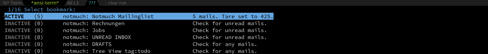

# notmuch alerts
Add and manage alerts 'on top' of notmuch bookmarks.

This package allows check bookmarked notmuch queries for either 'new'
or 'unread' mails. It further provides an API to visit, create, check
and remove alerts. Alerts are always created 'on top' of existing
notmuch bookmarks, that is, they extend a bookmared query by adding an
additional filter query.

This file is NOT part of notmuch or the notmuch emacs suite.

# What is an alert?

An alert is a function receiving one argument, a bookmark. It is up to
this function to build and run the query which checks for matching
mails. The package provides some helpful functions for that. The
return value of the alert function must be either `nil`, indicating
that nothing happened ("inactive alert"), or the number of relevant
mails matched ("active alert"), as an integer.

# Features

 - Interactively add or remove alert in a bookmarked notmuch buffer.
 - Set a "tare" value for counting mails which is automatically
   subtracted before deciding whether there are any new or unread
   mails. Thus, you can 'silence' an alert without changing the status
   of the existing mails -- they are just not counted in.
 - Provide an interactive selection of all alerts and bookmarks,
   sorted by relevancy.

# Dependencies

This package depends on the following packages:

 - Emacs > 26.1
 - notmuch
 - notmuch-bookmarks
 
# Installation

I have the following snippet in my `init.el`:

```
(use-package notmuch-bookmarks
  :after notmuch
  :config
  (notmuch-bookmarks-mode))

(use-package notmuch-alert
  :config
  (notmuch-alert-mode)
  :bind*
  (:map global-map
	("<f3>" . notmuch-alert-visit)))
```

It is recommended to activate the automatic saving of bookmarks. This
way, your bookmarks with alerts become constant entry points for
accessing your mails. The result comes very close to what you are used
to in a normal mail client, yet preserves the "emacs" way of doing
stuff:

```
(use-package bookmark
 :config
 (setq bookmark-save-flag 1))
```

# Interactive Functions

## notmuch-alert-install
Install an alert in the bookmark associated with the current buffer.

Let the user select between a set of predefined alerts and 'hooks' it
into the bookmark. If `bookmark-save-flag`is `t`, automatically save
the changed bookmark.

The available alerts are predefined in the global variable
`notmuch-alerts`. See below for adding new alerts.

## Predefined alerts

 Currently, there are three alerts defined:

<dl>
 <dt>notmuch-alert-unread</dt>
 <dd>Check for any unread mails.</dd>
 
 <dt> notmuch-alert-any</dt>
 <dd>Check for any mails matching the original bookmark query; no further filtering.<dd>

<dt>notmuch-alert-today:</dt>
<dd>Check for any mails from today.</dd>

 </dl>
 
## Defining new alerts

To define a new alert, you have to follow these steps:

 1. Create a function which returns a new `notmuch-alert` object.
 2. Add this function name to  the variable `notmuch-alerts`.
 
Let's define a new alert which is raised when a new unread attachment
has arrived. 

First, you define the alert object itself. This is usally done via
`make-notmuch-alert`. You pass to it as one of its argument a filter
query. In our case, a good query would be `date:today and
is:attachment`. Thus, you create the following function:

``` emacs-lisp
(defun notmuch-alert-unread-attachment ()
  "Create a new alert object for unread mails with attachment."
  (make-notmuch-alert :filter "date:today"
		      :description "Check for mails from today"
		      :format-string "%d mails from today"))

```

The keywords are rather self-explaning. `:description` is the
description of the alert as it will be presented to the user, i.e.
when selecting one of the available alerts for installation.
`:format-string` will be used to present the number of active mails
(use `%d` since the count is an integer).

In a second step, you add this function to `notmuch-alerts`:

``` emacs-lisp
(add-to-list 'notmuch-alerts 'notmuch-alert-unread-attachment)
```

That's all. You can now set your new alert on an existing bookmark via
`notmuch-alert-install`.
 
## notmuch-alert-uninstall

Uninstall current buffer's bookmark alert.

## notmuch-alert-visit

Present the user a selection consisting of, in this order,

 - a list of all active alerts,
 - a list of all inactive alerts, and ultimately
 - a list of all other notmuch bookmarks, which have no alert
   associated with it.
 


As a special bonus, calling `notmuch-alert-visit` modifies the keymap
so that pressing the calling key twice will cancel the action. This is
meant for offering a quick way to 'check mails': Since all active
alerts appear on the top of the list, pressing the key once gives you
an immediate feedback about newly arrived mails. By pressing the key
again, you return to work.

If you do not like this behaviour, set
`notmuch-alert-visit-quit-when-pressed-twice` to `nil`.

## notmuch-alert-tare

Set the tare for the current buffer. With prefix, just display the
current value. With double prefix, remove the tare.

A *tare* is a bookmark local value which wil be automatically
substracted before checking whether an alert should be raised. For
example, if you have 3 unread mails and 'tare' the alert, the alert
will remain inactive from now on unless new mails arrive. 

Do not forget that changing the mails effectively invalidates the
tare. If you mark the unread mails as read, and then 3 new mails
arrive, you won't be notified. From the standpoint of numbers, the
effective mail count is 0, whether you count 3 old unread mails or 3
newly arrived unread mails. Thus, do not forget to remove a tare in
time.

Setting a tare of 0 effectively means to remove the tare.

 


